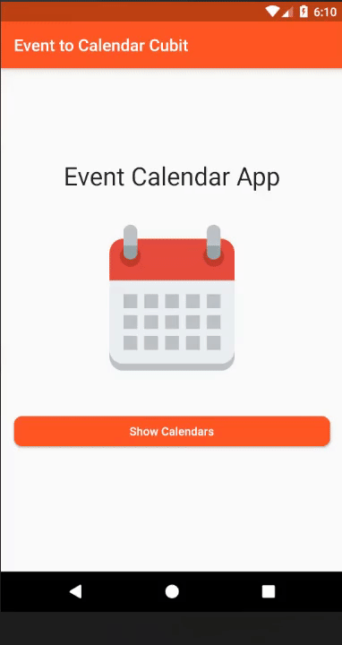

## About

App that uses Device Calendar plugin to create and update events to all calendars.

https://pub.dev/packages/device_calendar

## Sample

## Doc
addToCalendar() 
 
- Method to add events to the user's calendar.
- Events will be added to the user's selected calendar.
- If the events have previously been added by the user, they will have a shared preference key for the Event ID and the event will be UPDATED instead of CREATED.
- If events are successfully created/added, snack-bar will be showed.
